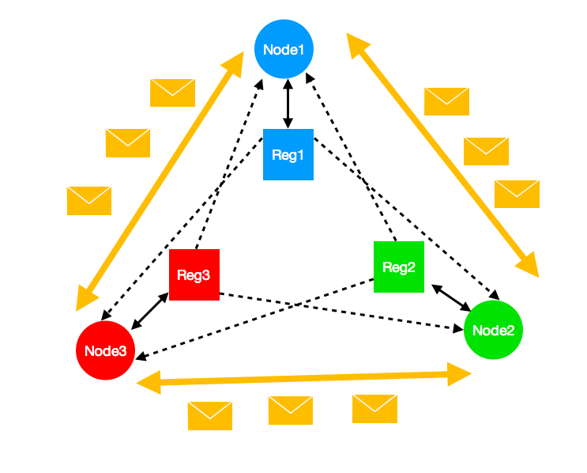

# Distributed-SWMR-registers

The ABD algorithm allows a set of distributed nodes, that communicate with a message-passing system (i.e. the Internet), to emulate a shared register. The register is a so called *single-writer* *multi-reader* register. This means that every node can read the register, but only the owner of the register can write to it. This implementation uses a modification of the ABD algorithm that allows all nodes to own a register, not just a single one.

The goal of this project is for me to become a better Rust programmer. For another project I have used the excellent [SSPBFT framework](https://github.com/sspbft/BFTList), which serves as an inspiration for this project. I wanted to create something similar to SSPBFT but in Rust.

## How to run

1. [Install Rust](https://www.rust-lang.org/tools/install).
2. Clone this repository.
3. Change directory to `local_starter` and type `cargo run -n 3 -w 3 -r 3 -p`.

This will create three nodes on your local computer that all write and read to the shared registers all the time. Each node will print to the terminal in its own color when it starts/ends and write or read operation. When a read operation ends, the values of all nodes' registers will also be shown. So you see a sequence of write and read operations and what the values of the registers were in the different places in that execution.

## ABD overview

The figure above shows a visualization of the ABD algorithm with three nodes. The three circles represent the nodes. The orange arrows and messages represent that the nodes comunicate by sending messages to each other. Each node has its own emulated register. The owner of a register can write and read its register, which is represented by the black solid bidirectional arrows. All nodes can read all other nodes' registers, which is represented by the black dashed unidirectional arrows.

## Repository overview

The `application` directory contains the code for an instance of an ABD node. On each computer you want to be part of this network, you run the code in this directory. More details are in `application/README.md`. This is the most important and interesting part of this repository.

The `local_starter` directory contains the code for a helper tool. `local_starter` automatically starts the user-supplied number of ABD nodes on the local machine, to simplify testing of the code. Note that `local_starter` is purely for convenience. `application` works as a standalone program. More details are in `local_starter/README.md`.

The `remote_starter` directory contains the code for another helper tool. `remote_starter` automatically starts ABD nodes on remote machines via SSH. More details are in `remote_starter/README.md`.

The `evaluator` directory contains the code for another helper tool. `evaluator` utilizes `remote_starter` to run different scenarios you define and aggregates the evaluation results.

## Platform compatibility

|                                 | Linux | Mac | Windows |
|---------------------------------|-------|-----|---------|
| application                     | Yes   | Yes | Maybe   |
| local_starter                   | Yes   | Yes | No      |
| remote_starter: local computer  | Yes   | Yes | No      |
| remote_starter: remote computer | Yes   | Yes | No      |
| evaluator: local computer       | Yes   | Yes | No      |
| evaluator: remote computer      | Yes   | Yes | No      |

## The modification

The implementation almost follows the ABD algorithm, but is modified to allow each processor to store own a register. This modification doesn't have a correctness proof, so I'm working on switching to the vanilla ABD.
