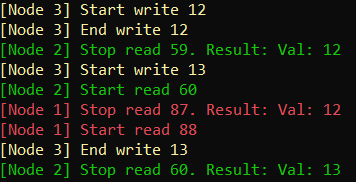

# Distributed-SWMR-register

In the area of distributed systems, there are two common models of communication: the message passing model and the shared memory model. In the message passing model, processors communicate by sending messages to each other (the Internet is an example of a message passing system), while in the shared memory model, processors communicate by writing to and reading from shared registers. The shared memory model is usually considered more high-level than the message passing model.

[The ABD algorithm](https://dl.acm.org/citation.cfm?id=200869) allows distributed processors, that communicate with messages, to *emulate* a shared register. The register is a so called *single-writer multi-reader* register. This means that every node can read the register, but only the owner of the register can write to it. The ABD implementation provides two functions that can be used by a higher-level programs on the same processor: the `read()` function and the `write()` function. These functions work exactly like a "normal" register, except that this register is distributed among several processors across a network.

The goal of this project is for me to become a better Rust programmer. For another project I have used the excellent [SSPBFT framework](https://github.com/sspbft/BFTList), which serves as an inspiration for this project. I wanted to create something similar to SSPBFT but in Rust.

## How to run

1. [Install Rust](https://www.rust-lang.org/tools/install).
2. Clone this repository.
3. Change directory to `local_starter` and type `cargo run -- 3 -w -r 2 -p`.

This will create three nodes on your local computer. One of them will continuously write to the register while the other two will continuously read from the register. Each node will print to the terminal in its own color when it starts/ends a write/read operation. When a read operation ends, the value of the register will be printed. So you see a sequence of write and read operations and what the value of the register was in the different places of that execution. An example is shown below:

Node 3 starts and ends write number 12 (which also happens to writes the value `12` to the register). Node 2 stops read 59 and gets `12`. Node 3 then starts write 13. Node 1 later reads `12`, which just means that the write hadn't been completed yet. However, at the end, Node 2 manages to read `13`.

## Repository overview

The `application` directory contains the code for an instance of an ABD node. On each computer you want to be part of this distributed system, you run the code in this directory. More details are in `application/README.md`. This is the most important and interesting part of this repository.

The `local_starter` directory contains the code for a helper tool. `local_starter` automatically starts the user-supplied number of ABD nodes on the local machine, to simplify testing of the code. Note that `local_starter` is purely for convenience. `application` works as a standalone program. More details are in `local_starter/README.md`.

The `remote_starter` directory contains the code for another helper tool. `remote_starter` automatically starts ABD nodes on remote machines via SSH. More details are in `remote_starter/README.md`.

The `commons` directory contains code that is shared between the above programs.

## Compatibility

|                                 | Linux | Mac | Windows |
|---------------------------------|-------|-----|---------|
| application                     | Yes   | Yes | Maybe   |
| local_starter                   | Yes   | Yes | No      |
| remote_starter: local computer  | Yes   | Yes | No      |
| remote_starter: remote computer | Yes   | Yes | No      |

## License

This project uses 3rd-party code, which is licensed under the BSD-3-License. The corresponding license file is `3RD-PARTY-LICENSES/rusty_self_stabilizing_snapshots_license`.
